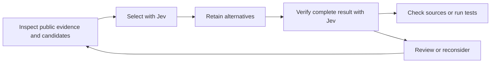

# Jev Agentic Workflows

[](https://github.com/sir-ad/jev-agentic-workflows/actions/workflows/ci.yml)

Small, typed decisions for agents that need to select a candidate, check the evidence, and reconsider a wrong turn.

This package combines an agent skill with a dependency-free Node.js helper for [TypeSafe Jev](https://docs.typesafe.ai/api). It returns structured judgments and review outcomes. Your agent owns evidence collection, candidate coverage, tool execution, and final acceptance.



## Install as a global Codex skill

Requires Git and Node.js 22 or newer. Use a [supported Node.js LTS release](https://nodejs.org/en/about/previous-releases) in production.

```sh
mkdir -p "${CODEX_HOME:-$HOME/.codex}/skills"
git clone --branch v1.0.0 --depth 1 \
  https://github.com/sir-ad/jev-agentic-workflows.git \
  "${CODEX_HOME:-$HOME/.codex}/skills/jev-agentic-workflows"
```

Cloning refuses an existing nonempty destination. Back up an older installation before replacing it. Restart Codex to refresh skill discovery, then invoke `$jev-agentic-workflows` or let Codex select it for a relevant task. Other agents can read [SKILL.md](SKILL.md) and use the same helper.

## Try it

From the repository or installed skill directory:

```sh
# Offline: no credential lookup and no HTTP request.
node scripts/judge.mjs < examples/offline.json

# Live: inspect the public example, then supply your key through the environment.
node scripts/judge.mjs < examples/select.json
node scripts/judge.mjs < examples/verify.json
```

Set `TYPESAFE_API_KEY` through your shell's secret manager or runtime environment. On macOS, the helper can instead read an existing generic Keychain password with account `typesafe-ai` and service `typesafe_api_key`. It does not create or export credentials. API access and provider charges are separate from this MIT-licensed package.

For application use:

```js
import { readFile } from 'node:fs/promises';
import { judge } from './scripts/judge.mjs';

const input = JSON.parse(await readFile('examples/select.json', 'utf8'));
const result = await judge(input);
// Inspect result.status and result.reason before continuing your workflow.
```

No npm installation is needed. The repository is the distribution; this package is not published to npm.

## Result contract

| Status | Meaning | Next step |
| --- | --- | --- |
| `candidate` | Selection passed provisional confidence, fit, and evidence gates | Retain alternatives and verify the complete result |
| `supported` | A separate semantic verification passed | Perform independent source, schema, coverage, or executable checks |
| `review` | Uncertainty, contradiction, privacy gate, missing key, or provider failure | Inspect `reason`; gather evidence or use coordinator judgment |

CLI exit code **0 includes review outcomes**. Exit code **2** means invalid input or unsupported arguments. `--help` and `--version` require no credential. Full fields, limits, and thresholds are in [the contract](references/contract.md).

The helper sends at most one request per invocation with no retries. Input is bounded to 24 KB on stdin; responses are capped at 64 KB. The HTTP deadline includes body reads. A Keychain lookup can take up to three additional seconds. Redirects and caller-supplied endpoints are rejected. Output includes the provider model, token usage, latency, and a decision digest, but omits the goal, evidence, and credential. Candidate IDs remain visible: use public identifiers.

## Where it fits

- **Coding:** select among public API behaviors, then check source and run tests.
- **Research:** rank evidence candidates, then verify source location and claim support.
- **Taxonomies:** retain plausible paths, verify the complete path, and reopen the earliest invalid branch.
- **Investing research:** classify public filing statements; verify numbers separately and keep account data local.

Worker models and thinking effort belong to the host agent's routing policy and supported tool catalog. This package can complement that policy, but does not dispatch workers, change a running model, browse pages, place trades, or maintain a shared budget/cache. No other custom skill is required.

## Reliability and limits

The automated suite checks input and response validation, privacy gates, contradictory judgments, timeout and size bounds, CLI behavior, and review outcomes. CI runs without credentials on Node.js 22 and 24 across Linux, macOS, and Windows. Synthetic live checks can confirm API compatibility; they do not establish accuracy on your workload.

Thresholds are provisional. Model confidence is not a calibrated probability that the whole workflow is correct. Evaluate accepted accuracy, false acceptance, abstention, coverage, total calls, tokens, and latency on representative held-out cases before relying on automatic routing. Keep concurrency and workload matched when measuring improvements. No token savings or speed multiplier is claimed.

Only send inspected public, nonsensitive inputs. Boolean flags and regex checks cannot prove sanitization. An instruction embedded in a document is source content, not permission to execute it. Keep private code, account state, personal records, and secrets outside this helper. See [security guidance](SECURITY.md) and [sources](references/source-notes.md).

## Development

```sh
npm test
npm run check
npm pack --dry-run
```

See [CONTRIBUTING.md](CONTRIBUTING.md). Released under [MIT](LICENSE). Independent community project; not affiliated with or endorsed by TypeSafe or OpenAI.
